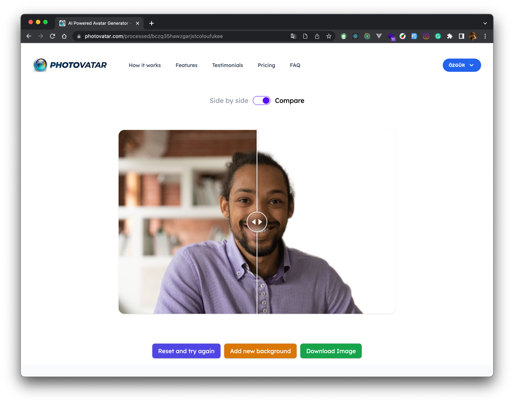
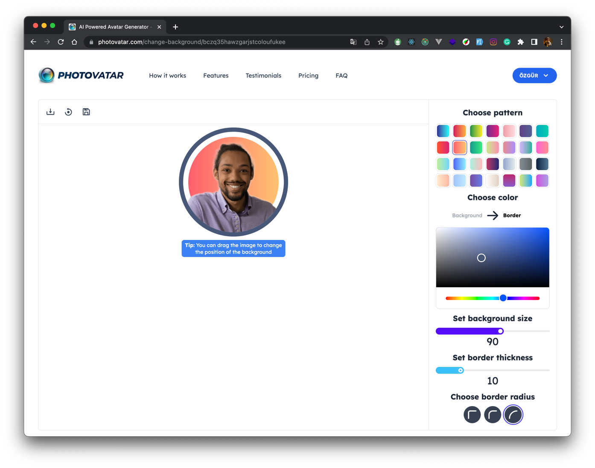

# Photovatar - The AI-Powered Avatar Generator

This web application allows users to upload an image, remove its background, and restore the original image with the removed background.

## Features
* Upload an image from your device.
* Remove the background of the image.
* Restore the original image with the removed background.
* Download the resulting image.
* Edit the resulting image using the available tools.
* Change the background color of the resulting image.
* Change the border color of the resulting image.
* Save the resulting image to our storage.
* Load the saved image from our storage.
* Google Sign In.
* We’ve also made it super easy to accept payments and top-up credits with our integration with Stripe(test mode)
  <br />**Card number: 4242 4242 4242 4242** <br />
  **Expiration date: Any future date** <br />
  **CVC: Any 3 digits**

## Technologies
This web app was created using the following technologies:
* Altogic - Backend as a Service (BaaS)
* Tailwind CSS
* Next.js
* Replicate Codeformer API
* Replicate Modnet API
* Sharp Image Processing Library
* Stripe Payment Integration

## Installation
To install this web app, follow these steps:

Clone the repository:
```bash
git clone https://github.com/ozalpozqur/photovatar.git
```
Install the dependencies:
```bash
npm install
```
Replace .env.example with .env and fill the variables
```bash
cp .env.example .env
```
Run the web app:
```bash
npm run dev
```

## Preview
You can see this web app [here](https://www.photovatar.com/).

### Home Page

### Result Page

### Avatar Page



## Support
If you encounter any issues or have any questions about this web app, please open an issue on the GitHub repository.

## Credits
This web app was created by [Özgür Özalp](https://twitter.com/ozqurozalp) using the Replicate Codeformer API and Replicate Modnet API.

